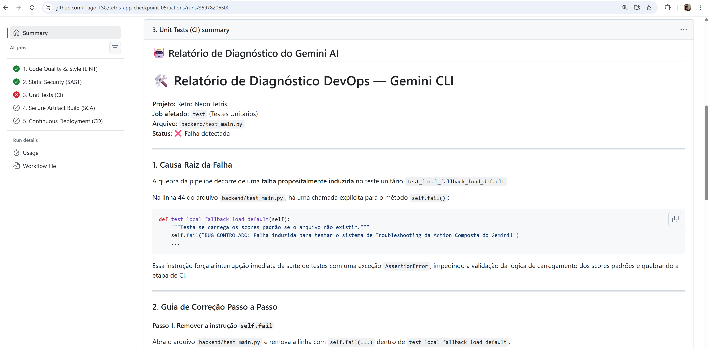

# 🕹️ Retro Neon Tetris — Cloud Run Arcade (Projeto Final)
<p align="left"><font size="5"><i>Sistemas Distribuídos Serverless • Orquestração SAGA • Inteligência Artificial (Gemini & Anti-Cheat) • Mensageria Pub/Sub • Áudio Procedural • Observabilidade GCP • DevSecOps</i></font></p>

Uma versão moderna, estilosa e extremamente sofisticada do clássico jogo **Tetris**, projetada com visual retro-wave/neon (Synthwave) e **Sintetizador de Áudio Procedural** nativo no navegador (usando a Web Audio API).

Esta versão unificada (**Projeto Final**) consolida toda a evolução técnica da aplicação, unindo a **Arquitetura de Microserviços e Orquestração Avançada (SAGA Pattern)**, a **Inteligência Artificial Aplicada (Gemini AI para Troubleshooting e Heurística Anti-Cheat)**, a **Instrumentação e Observabilidade Nativa no GCP** e a **Automação DevSecOps** com uma pipeline completa de CI/CD via GitHub Actions e portões estritos de segurança e qualidade. O projeto agrega ferramentas automáticas de SAST (Bandit), SCA (Trivy), detecção de segredos (Gitleaks), conformidade sintática (ESLint, Ruff, Hadolint), testes unitários contínuos e implantação contínua segura via WIF no Google Cloud Run.

## 🎨 Interface do Jogo


*Visualização da interface com estilo neon synthwave, exibindo o canvas do jogo (centro), controles (esquerda), próximas peças e estatísticas (direita) com sistema de ranking integrado.*

O projeto é estruturado com um backend assíncrono em **Python (FastAPI)** que gerencia a API de pontuações de recorde persistida no Firestore. O frontend é servido de forma estática, construído em **HTML5 Canvas, CSS moderno e JavaScript Vanilla** com **UI Otimista** para respostas instantâneas e **Feedback Visual de Conquistas**.

Este aplicativo foi planejado e otimizado especificamente para rodar localmente e ser facilmente implantado de forma escalável no **Google Cloud Run (GCP)**.

---

## 🚀 Funcionalidades e Diferenciais
*   **Sintetizador de Áudio Procedural (Web Audio API):** Som clássico de arcade gerado por código diretamente na placa de som do seu computador, dispensando carregamento de arquivos externos `.wav` ou `.mp3`.
*   **Interface Assíncrona Otimista (Novo):** O frontend não trava esperando o banco de dados. Os placares são inseridos na tela instantaneamente enquanto o Pub/Sub garante a gravação no fundo.
*   **Telemetria em Tempo Real e Conquistas (Novo):** O jogo captura eventos de "Level Up", "Tetris" e "Linhas Limpas" em tempo real, desbloqueando **Badges (Troféus)** que aparecem brilhando no meio da tela e ficam gravados ao lado do seu nome no Ranking mundial.
*   **Algoritmo Bag-of-7 (Mecânica Justa):** Geração de peças igual à do Tetris oficial de campeonato, garantindo que o jogador não sofra com sequências de azar sem peças fundamentais.
*   **Sistema de Níveis Progressivo:** O nível de dificuldade aumenta a cada 10 linhas removidas, acelerando a queda das peças de forma fluida e aplicando multiplicadores à pontuação.

---

## 🏛️ Evolução Arquitetural (Fases 1 a 6)

O projeto original usava armazenamento local em disco, o que é incompatível com a natureza Serverless Efêmera do Cloud Run. O sistema foi refatorado nas seguintes fases:

### Fase 1: Persistência Robusta
*   **Google Cloud Firestore:** O backend foi integrado ao banco de dados NoSQL gerenciado do Google. Todos os scores recebidos são gravados de forma permanente, resolvendo o problema de perda de dados.

### Fase 2: Event-Driven Architecture e CQRS
O sistema agora separa completamente as responsabilidades de leitura (Query) e escrita (Command).
1.  **Ingestão e Escrita (Pub/Sub):** Quando um jogador envia um placar, a API principal do FastAPI apenas publica a mensagem no tópico do **Google Cloud Pub/Sub** e responde "Sucesso" na mesma hora (absorvendo picos de tráfego).
2.  **Processamento Assíncrono (Webhook):** A fila do Pub/Sub envia a mensagem em background (via protocolo Push) para a rota interna `/api/internal/scores-worker`.
3.  **Geração do Cache Materializado (CQRS):** Após o worker gravar o score cru no Firestore, ele próprio processa o novo ranking ("Top 10") e salva um documento consolidado em `/cache/leaderboard`.
4.  **Leitura Otimizada:** Quando milhares de jogadores abrem o jogo simultaneamente, a rota `GET /api/scores` lê **apenas 1 documento estático** do Firestore (o cache), reduzindo a latência a milissegundos e eliminando o custo em nuvem de queries de ordenação massivas.

### Fase 3: Telemetria e Padrão Fan-out (Coreografia)
A arquitetura foi expandida para suportar monitoramento de eventos ao vivo durante a partida.
1.  **Emissão de Eventos (Frontend):** O `game.js` dispara pacotes silenciosos para a API sempre que o jogador sobe de nível ou faz um Tetris.
2.  **Barramento de Mensageria:** A API despacha esses eventos para um segundo tópico do Pub/Sub (`telemetry-topic`).
3.  **Coreografia Autônoma:** Um Webhook secundário (`/api/internal/telemetry-worker`) ouve a fila, atualiza os contadores globais do jogador e roda o "Motor de Regras" para conceder medalhas na coleção `achievements`, de forma totalmente desacoplada do salvamento principal de scores.

### Fase 4: Microserviços, Orquestração e Anti-Cheat com IA
O sistema monolítico foi refatorado e expandido adotando padrões modernos de orquestração distribuída (simulando capacidades do Google Cloud Workflows):
1. **APIs Atômicas (Desacoplamento):** Lógicas separadas em microserviços virtuais: Carteira Virtual (Moedas), Inventário de Temas, Gestão de Contas (Banimentos) e Validação de Segurança.
2. **Loja de Skins (Padrão Saga):** Novo fluxo orquestrado `buy_skin_workflow`. Ao comprar um tema, o serviço debita a carteira e desbloqueia no inventário. Se houver falha, ele executa uma **transação compensatória (rollback)** para reembolsar o saldo, garantindo consistência atômica.
3. **Validação de Scores (Árvore de Decisão e Anti-Cheat):** O envio de placar passa pelo fluxo `submit_score_workflow`. Um Motor Heurístico analisa a cadência dos toques do teclado: Se detectar bot, bane permanentemente. Se for humano, recompensa o usuário com moedas virtuais além de registrar o placar.
4. **Terminal Maestro e UI Didática:** Introdução de um console interativo estilo hacker no front-end para visualizar a orquestração em tempo real.
5. **Engine de Áudio Expandida:** Sintetizador turbinado de 1 para 6 oitavas de cobertura (C2 a B7), com script matemático para compilar clássicos (Senhor dos Anéis em BPM perfeito, Star Wars, Pink Panther) renderizados no Web Audio API nativo.

### Fase 5: Observabilidade e Instrumentação no GCP
A arquitetura evoluiu para contemplar governança e confiabilidade corporativas completas, introduzindo instrumentação nativa do Google Cloud de ponta a ponta (Logs, Métricas e Traces):
1. **Logs Estruturados em JSON (Cloud Logging):** O logger padrão do backend em Python foi modificado para utilizar uma classe customizada `GCPJsonFormatter`. Todos os registros de log agora são impressos em streams de saída estruturados em JSON no formato esperado pelo GCP, injetando automaticamente campos como `severity`, `session_id`, `saga_step`, `transaction_id` e metadados de execução.
2. **Métricas Personalizadas (Cloud Monitoring):** Integração segura com o SDK do Google Cloud Monitoring para emitir métricas personalizadas de negócio e infraestrutura de forma assíncrona, incluindo:
   - `tetris/store/skins_sold`: Contagem de transações de skins (sucesso, rollback e DLQ).
   - `tetris/db/cache_hits`: Taxa de acerto e uso de cache materializado no Firestore.
   - `tetris/anticheat/detections`: Quantidade de detecções de robôs vs humanos efetuadas pela IA.
   - `tetris/game/scores_submitted`: Volume de submissões de pontuação ao ranking.
3. **Rastreamento Distribuído (Cloud Trace):** Ativação e propagação automática de cabeçalhos de contexto de trace (`X-Cloud-Trace-Context`) entre o navegador, o balanceador de carga do Cloud Run e os orquestradores de GCP Workflows, gerando gráficos de Gantt detalhados na console do Cloud Trace para aferição de latências e caminhos de rede.
4. **Logs Nativos de Workflows:** Configuração de nível `TRACE_ALL_CALLS` nos orquestradores serverless (`buy_skin_workflow.yaml` e `submit_score_workflow.yaml`) para visibilidade total de etapas e compensações SAGA no Log Explorer.
5. **Agregação de Erros de Frontend:** Implementação de um monitor global de erros em JS (`window.addEventListener('error')`) que reporta automaticamente exceções ocorridas no navegador do jogador para o endpoint `/api/logs` do backend, centralizando os erros de frontend no GCP Error Reporting.
6. **Resiliência e Fallback Local:** O código foi projetado de forma defensiva para auto-detectar o ambiente. Se as bibliotecas do GCP não puderem se conectar ao barramento na nuvem (como no desenvolvimento local), o sistema chaveia automaticamente para impressão local formatada, garantindo testes locais perfeitamente offline.

### Fase 6: Automação DevSecOps e Pipeline Integrada
A arquitetura atingiu maturidade de nível corporativo ao introduzir uma esteira automatizada de Integração, Qualidade, Segurança e Entrega Contínuas (CI/CD) via GitHub Actions, garantindo que nenhum código seja implantado sem passar por rigorosos portões de qualidade (Quality Gates):
1. **Varredura Estática de Segredos (Gitleaks):** Análise automatizada de todo o histórico de commits para detecção preventiva de chaves de API, senhas ou tokens expostos.
2. **Qualidade e Estilo de Código (Ruff & ESLint):** Linting automatizado de Python com Ruff (ultrarrápido) e de JavaScript (Flat Config `eslint.config.mjs`) para manter os padrões e a legibilidade do código.
3. **Análise de Segurança do Código (Bandit SAST):** Análise estática focada em vulnerabilidades de segurança específicas do ecossistema Python (FastAPI).
4. **Análise de Segurança de Dependências e Infraestrutura (Trivy SCA):** Varredura de segurança de pacotes (filesystem) e da imagem Docker gerada para identificação de CVEs (vulnerabilidades e exposições comuns) de níveis crítico/alto, garantindo a imunidade do ambiente de execução.
5. **Linting de Infraestrutura como Código (Hadolint):** Validação estática das instruções do `Dockerfile` visando otimização de camadas, redução de tamanho e eliminação de privilégios elevados.
6. **Testes Unitários Automatizados (CI):** Execução automática de testes unitários para garantir a estabilidade do backend a cada alteração.
7. **Autenticação sem Segredos (Workload Identity Federation):** Conexão direta e segura com o GCP eliminando chaves estáticas JSON no repositório.
8. **Implantação Contínua Automatizada (CD):** Publicação automatizada da imagem segura no Artifact Registry, deploy automático para o Cloud Run e deploy imediato dos workflows de orquestração do GCP Workflows.
9. **Varredura Dinâmica Ativa Sob Demanda (DAST - OWASP ZAP):** Pipeline isolada (`dast.yml`) executável de forma manual e segura que realiza simulações de ataques de injeção em um ambiente efêmero local, gerando relatórios dinâmicos completos.

### 🎓 Adequação para o Projeto Final (Unificação e Promoção para `tetris-app`)
Para a entrega consolidada do **Projeto Final**, toda a evolução histórica e as tecnologias desenvolvidas do **Checkpoint 01 ao Checkpoint 05** foram unificadas em um único repositório limpo.
* **Promoção de Nome (Adequação de Produção):** O serviço de deploy e as referências foram promovidos de `tetris-app-checkpoint-05` para o nome final de produção unificado **`tetris-app`**, garantindo uma identidade limpa e profissional no console do Google Cloud Platform (Cloud Run, Workflows e Pub/Sub).
* **Portabilidade de Ferramentas:** Os scripts locais de desenvolvimento (`gen_music.py` e `replace_script.py`) foram atualizados de caminhos locais absolutos para caminhos relativos (`static/js/game.js`), tornando o projeto totalmente autocontido, portátil e executável em qualquer ambiente local.
* **Histórico Preservado:** Todo o histórico de evolução do Git de cada uma das fases anteriores foi perfeitamente sequenciado de forma linear, garantindo a rastreabilidade total do desenvolvimento acadêmico.

---

## 🛠️ Arquitetura do Projeto

```text
├── .github/                   # Configurações do GitHub (Actions e Workflows)
│   ├── actions/
│   │   └── gemini-troubleshoot/
│   │       └── action.yml     # Action customizada de diagnóstico com IA Gemini
│   └── workflows/
│       ├── dast.yml           # Pipeline de testes dinâmicos de segurança (OWASP ZAP)
│       └── pipeline.yml       # Pipeline principal DevSecOps (Lint, SAST, CI/CD, SCA)
├── backend/
│   ├── main.py                # Servidor FastAPI com APIs atômicas, CQRS, Maestro Simulador e Webhooks
│   ├── requirements.txt       # Dependências de bibliotecas Python
│   └── test_main.py           # Suíte de testes automatizados do backend
├── static/                    # Pasta com os ativos de frontend servidos pelo FastAPI
│   ├── css/
│   │   └── style.css          # Estilos modernos neon, grade e animações
│   ├── js/
│   │   ├── api.js             # Funções de chamadas HTTP (Wallet, Inventory, Anti-Cheat, Orquestrador)
│   │   └── game.js            # Lógica do jogo, telemetria e sintetizador matemático Web Audio
│   └── index.html             # Esqueleto da página e modais (Loja, Placar, Terminal Maestro)
├── buy_skin_workflow.yaml     # Definição do fluxo orquestrado da loja (Saga, Retries, Rollback)
├── submit_score_workflow.yaml # Definição da Árvore de Decisão do Anti-Cheat e gravação
├── gen_music.py               # Script local de geração procedural de melodias matemáticas
├── generate_freqs.py          # Script utilitário para calcular frequências das notas musicais
├── generate_melodies.py       # Script utilitário para estruturar melodias em arrays JSON
├── replace_script.py          # Script de injeção automática de melodias no game.js
├── freqs.json                 # Banco de dados local das frequências calculadas de notas
├── new_melodies.js            # Melodias geradas temporárias para validação
├── Dockerfile                 # Instruções de montagem da imagem Docker (Cloud Run)
├── .dockerignore              # Exclusão de arquivos desnecessários na imagem Docker
├── .gitignore                 # Exclusão de arquivos de versionamento e venv
├── .trivyignore               # Exceções de vulnerabilidade de pacotes upstream homologadas
├── tetris-app.jpg             # Captura de tela da interface do jogo
├── ai_report.png              # Captura de tela do relatório de diagnóstico emitido pelo Gemini
└── README.md                  # Esta documentação completa do projeto
```

---

## 🏛️ Arquitetura e Fluxo de Infraestrutura do Sistema

Para suportar alta escalabilidade, isolamento de privilégios e tolerância a falhas, a infraestrutura da aplicação foi desenhada utilizando serviços 100% serverless, desacoplados e orientados a eventos no **Google Cloud Platform (GCP)**.

O diagrama abaixo ilustra o fluxo de dados de ponta a ponta e a integração entre os componentes de computação, mensageria, persistência, orquestração e observabilidade:

```text
                                    ┌──────────────────────────────────────────────────────────┐
                                    │                    FRONTEND (Navegador)                  │
                                    │  ┌───────────────────────┐    ┌───────────────────────┐  │
                                    │  │    HTML5 Canvas UI    │    │   Console Maestro UI  │  │
                                    │  └───────────┬───────────┘    └───────────▲───────────┘  │
                                    └──────────────┼────────────────────────────┼──────────────┘
                                                   │                            │
                                                   │ HTTP Requests / REST       │ Server-Sent Events (SSE)
                                                   │ (Scores, Skins, Telemetry) │ (Real-Time Orchestration Logs)
                                                   ▼                            │
                                    ┌───────────────────────────────────────────┴──────────────┐
                                    │                 BACKEND (Google Cloud Run)               │
                                    │  ┌───────────────────────┐    ┌───────────────────────┐  │
                                    │  │  FastAPI REST Server  │    │  Webhooks (CQRS)      │  │
                                    │  └───────────┬───────────┘    └───────────▲───────────┘  │
                                    └──────────────┼────────────────────────────┼──────────────┘
                                                   │                            │
                     ┌─────────────────────────────┼────────────────────────────┼─────────────────────────────┐
                     │ (Chamadas do Workflow)      ▼ (Publicação de Eventos)    ▲ (Push Subscriptions Webhook)│
                     ▼                             │                            │                             │
        ┌────────────┴───────────┐         ┌───────┴───────┐            ┌───────┴───────┐         ┌───────────┴───────────┐
        │   Google Cloud         │         │Google Cloud   │            │ Google Cloud  │         │     Google Cloud      │
        │   Workflows (SAGA)     │         │Pub/Sub        │            │ Firestore     │         │     Observability     │
        │                        │         │               │            │ (Database)    │         │                       │
        │ ┌────────────────────┐ │         │ ┌───────────┐ │            │ ┌───────────┐ │         │ ┌───────────────────┐ │
        │ │ buy_skin_workflow  │ │         │ │ scores-   │ │            │ │  scores   │ │         │ │   Cloud Logging   │ │
        │ └────────────────────┘ │         │ │ topic     │ │            │ └───────────┘ │         │ └───────────────────┘ │
        │ ┌────────────────────┐ │         │ └───────────┘ │            │ ┌───────────┐ │         │ ┌───────────────────┐ │
        │ │submit_score_workfl │◄├─────────┼───────────────┼───────────►│achieveme- │ │         │ │  Cloud Monitoring │ │
        │ └────────────────────┘ │         │ ┌───────────┐ │            │ │   nts     │ │         │ └───────────────────┘ │
        │                        │         │ │ telemetry-│ │            │ └───────────┘ │         │ ┌───────────────────┐ │
        │                        │         │ │ topic     │ │            │               │         │ │   Cloud Trace     │ │
        │                        │         │ └───────────┘ │            │               │         │ └───────────────────┘ │
        └────────────────────────┘         └───────────────┘            └───────────────┘         └───────────────────────┘
```

---

### 🔄 Funcionamento Detalhado dos Fluxos do Sistema

A arquitetura do **Retro Neon Tetris** é sustentada por três grandes fluxos dinâmicos que implementam padrões avançados de sistemas distribuídos corporativos:

#### 1. Fluxo de Submissão de Score & Anti-Cheat (Arquitetura CQRS)
Para garantir resiliência contra trapaças e escalabilidade extrema nas leituras, o ranking adota a separação de responsabilidades entre escrita e leitura (CQRS):
*   **Write/Command Path (Caminho de Escrita Orquestrado):**
    1.  O jogador finaliza a partida e o frontend submete a pontuação de forma criptografada para o backend FastAPI.
    2.  O backend apenas publica um evento leve contendo a intenção no tópico **`scores-topic`** do **Cloud Pub/Sub** e responde instantaneamente com `202 Accepted` ao jogador (evitando bloqueios de interface).
    3.  A assinatura de push do Pub/Sub encaminha de forma assíncrona o evento para o orquestrador **`submit_score_workflow`** do **Cloud Workflows**.
    4.  O Workflow executa uma **Árvore de Decisão** chamando de volta a rotina heurística do Cloud Run que avalia o ritmo dos toques (detecção de bots).
    5.  Se a IA detectar trapaça, ela rejeita o score, registra o banimento e loga o incidente. Se passar no teste, o Workflow grava a pontuação de forma oficial no **Cloud Firestore** e notifica o frontend em tempo real.
*   **Read Path (Caminho de Leitura de Alta Performance):**
    1.  O frontend solicita o leaderboard global.
    2.  A API do Cloud Run busca a coleção `scores` do **Firestore** aplicando um **Cache Materializado em memória** com TTL (Time-To-Live). Isso permite atender a milhares de leituras instantâneas em sub-milissegundos sem realizar requisições diretas e dispendiosas ao banco NoSQL para cada jogador.

#### 2. Compra de Skins & Transações Distribuídas (Padrão SAGA Orquestrado)
Para manter a consistência financeira sem a necessidade de acoplamento rígido de bancos de dados ACID tradicionais, as transações da loja de skins utilizam orquestração serverless pelo padrão SAGA:
1.  O jogador solicita a compra de um tema neon na loja.
2.  A chamada HTTP síncrona aciona o backend, que despacha de forma assíncrona a orquestração para o workflow **`buy_skin_workflow`**.
3.  **Ação Local 1 (Débito):** O workflow efetua o débito das moedas virtuais na carteira do usuário na coleção `users` do Firestore.
4.  **Ação Local 2 (Entrega):** O workflow tenta registrar a skin no inventário do usuário.
5.  **Mecanismo de Compensação (Rollback):** Se a etapa de entrega falhar por qualquer motivo (ex: erro de rede, indisponibilidade ou estouro de limite), o motor de workflows detecta a quebra de contrato e dispara de forma automática a **Transação Compensatória**: o reembolso imediato do saldo debitado na carteira, mantendo o estado do sistema consistente e livre de fraudes ou perdas.

#### 3. Telemetria Ativa e Conquistas (Coreografia Event-Driven)
Enquanto o usuário está jogando, o frontend emite dados em background (taxa de linhas limpas por segundo, velocidade, nível alcançado):
1.  As métricas de telemetria são recebidas pelo endpoint `/api/telemetry` no Cloud Run.
2.  Os payloads estruturados são injetados diretamente no tópico **`telemetry-topic`** do Pub/Sub.
3.  Assinantes paralelos processam as estatísticas agregadas e atualizam de forma assíncrona a coleção **`achievements`** no Firestore se o jogador desbloquear novos troféus (badges), gerando notificações visuais otimistas no painel do navegador.

#### 4. Observabilidade Nativa e Diagnóstico de Erros (Telemetry Loop)
Toda a infraestrutura se beneficia de um ciclo fechado de observabilidade estruturada:
*   **Traces Distribuídos:** Cada requisição do jogador gera um ID de trace único (`X-Cloud-Trace-Context`) que é propagado pelo Cloud Run, Pub/Sub e Workflows. Isso permite gerar gráficos de Gantt no **Cloud Trace** para identificar gargalos em microsegundos.
*   **Logs Estruturados:** Logs de erro do frontend (capturados via `window.onerror`) e logs estruturados em JSON do backend são integrados no **Cloud Logging** e agregados diretamente no **GCP Error Reporting** para alertas proativos em tempo real.

---

## 🤖 Inteligência Artificial no Projeto

A Inteligência Artificial é integrada ao **Retro Neon Tetris** em duas frentes distintas, complementares e altamente sofisticadas, elevando a aplicação ao patamar de um sistema inteligente moderno:

### 🧠 Os Dois Pilares de IA do Sistema

#### 1. IA Generativa: Agente Autônomo de Troubleshooting (Google Gemini 1.5 Flash)
*   **Contexto:** Integrado à esteira de **DevSecOps (GitHub Actions)**.
*   **Funcionamento:** Quando ocorre uma falha em qualquer portão de qualidade (Lint, SAST, Testes ou Build), a Action customizada `.github/actions/gemini-troubleshoot` é disparada. O agente extrai os logs da CLI do GitHub (`gh run view --log-failed`), detecta automaticamente a causa raiz e gera um diagnóstico com sugestões precisas de patches de código no próprio console da pipeline, economizando tempo precioso de debugging.



*Exemplo de relatório dinâmico emitido de forma autônoma pela API do Gemini ao detectar falhas em etapas lógicas do repositório.*

#### 2. IA Heurística: Motor de Detecção de Padrões e Anti-Cheat (Keystroke Dynamics)
*   **Contexto:** Integrado ao **Runtime de Produção** e orquestrado via **Google Cloud Workflows**.
*   **Funcionamento:** Monitora continuamente a telemetria comportamental do usuário em milissegundos. Ao submeter uma pontuação, a heurística calcula o desvio padrão dos intervalos das teclas. Se o desvio for nulo ou menor que `5ms` (padrão de bots/macros ou injeções diretas de API), o sistema barra o score e bane o ID de sessão de forma assíncrona.

---

### 🚦 Fluxo da Árvore de Decisão do Anti-Cheat

```text
┌─────────────────┐       ┌─────────────────┐       ┌─────────────────┐       ┌──────────────────┐
│  SCORE SUBMIT   │ ───►  │ CLOUD PUB/SUB   │ ───►  │ CLOUD WORKFLOWS │ ───►  │ ANTI-CHEAT API   │
│  (Keystroke     │       │ (scores-topic)  │       │ (Orchestrator)  │       │ (Heuristic Eval) │
│  Telemetries)   │       └─────────────────┘       └────────┬────────┘       └────────┬─────────┘
└─────────────────┘                                          │                         │
                                                             │ ◄───────────────────────┘
                                                             ▼ Decision
                                                    /─────────────────\
                                                   /   HUMAN OR BOT?   \
                                                   \───────────────────/
                                                     /               \
                                            HUMAN   /                 \  BOT (ROBOT)
                                                   ▼                   ▼
                                            ┌─────────────┐     ┌──────────────┐
                                            │ SAVE SCORE  │     │ BAN ACCOUNT  │
                                            │ (Firestore) │     │ (Firestore)  │
                                            └─────────────┘     └──────────────┘
```

---

### 🧪 Demonstração de Caso Real: Simulação de Ataque via API (gcurl)

Para simular o comportamento de um trapaceiro tentando injetar um score milionário diretamente no servidor de produção do GCP via terminal (bypassando a interface do navegador), você pode rodar o comando `curl` abaixo:

```bash
curl -X POST https://tetris-app-55ykz33xga-uc.a.run.app/api/orchestrate/submit-score \
  -H "Content-Type: application/json" \
  -d '{
        "name": "Hacker_GCP",
        "score": 999999,
        "level": 20,
        "lines": 100,
        "session_id": "PLAYER-4CTTDDI",
        "keystrokes": []
      }'
```

#### 📋 Resposta do Servidor (Log de Auditoria e Banimento do Workflow SAGA):
O motor serverless de orquestração do GCP reage instantaneamente de forma integrada, bloqueando a requisição e retornando o log detalhado dos passos de segurança distribuídos:

```json
{
  "status": "banned",
  "message": "Uso de Auto-Bot/Cheat detectado pela IA! Sua sessão foi banida permanentemente.",
  "logs": [
    "[Workflows] Iniciando fluxo 'submit_score_workflow' para o jogador 'Hacker_GCP'",
    "[Workflows] Executando consulta HTTP GET -> /api/accounts/status",
    "[Workflows] Executando chamada HTTP POST -> /api/anti-cheat/analyze (0 teclas coletadas)",
    "[AntiCheatService] IA classificou o estilo de jogo como: 'ROBOT'",
    "[Workflows] Decisão: ROTA BOT (Rígida). Acionando banimento de conta.",
    "[Workflows] Executando chamada HTTP POST -> /api/accounts/ban",
    "[Workflows] Placar de trapaça descartado. Conta banida da infraestrutura."
  ]
}
```

Isso garante que mesmo que um hacker tente fazer engenharia reversa nas APIs, as defesas automatizadas baseadas em comportamento a nível de infraestrutura protegem o ecossistema de ponta a ponta.

---

## 🔌 Especificação da API REST (Contratos de Microserviços)

Para garantir o desacoplamento de lógicas (Mural de Scores, Inventário de Skins, Carteira Virtual, IA de Detecção), o backend implementa um conjunto de **APIs REST atômicas** que atuam como contratos claros de comunicação.

Abaixo está o catálogo completo das rotas disponíveis e seu respectivo papel operacional:

| Método | Endpoint | Escopo / Microserviço | Descrição Operacional |
| :---: | :--- | :--- | :--- |
| **`GET`** | `/api/scores` | Mural de Ranking (CQRS) | Retorna o ranking global dos 10 melhores recordes (Placar de Líderes). Usufrui de **Cache Materializado** em memória. |
| **`POST`** | `/api/scores` | Mural de Ranking (CQRS) | Envia uma intenção de score. Em produção, publica o payload no Pub/Sub e retorna `202 Accepted` de forma assíncrona. |
| **`POST`** | `/api/telemetry` | Telemetria e Conquistas | Recebe os pacotes de dados do jogo em background durante a partida e os injeta no barramento de eventos (`telemetry-topic`). |
| **`GET`** | `/api/achievements/{session_id}` | Conquistas / Badges | Retorna a lista de troféus e conquistas desbloqueadas para a sessão de jogo informada. |
| **`GET`** | `/api/wallet/{session_id}` | Carteira Virtual | Consulta o saldo atualizado de moedas virtuais do usuário associado à sessão. |
| **`POST`** | `/api/wallet/debit` | Carteira Virtual | Executa o débito de moedas (Ação do Workflow SAGA). Protegido contra saldo insuficiente. |
| **`POST`** | `/api/wallet/credit` | Carteira Virtual | Executa o crédito de moedas (Ação de Recompensa / Compensação SAGA). |
| **`GET`** | `/api/inventory/{session_id}` | Inventário de Temas | Lista todas as skins adquiridas e desbloqueadas pelo jogador daquela sessão. |
| **`POST`** | `/api/inventory/unlock` | Inventário de Temas | Desbloqueia permanentemente uma skin no inventário do usuário (Ação do Workflow SAGA). |
| **`POST`** | `/api/inventory/select` | Inventário de Temas | Ativa e seleciona uma skin específica do inventário do usuário para exibição visual no jogo. |
| **`GET`** | `/api/store/catalog/{session_id}` | Loja de Skins | Consulta o catálogo de skins disponíveis para compra, exibindo preços e estado de aquisição. |
| **`POST`** | `/api/orchestrate/buy-skin` | Orquestração SAGA | Ponto de entrada do usuário para a compra de skins. Inicializa de forma assíncrona o `buy_skin_workflow`. |
| **`POST`** | `/api/orchestrate/submit-score` | Orquestração SAGA | Ponto de entrada para submissão de pontuação. Inicializa de forma assíncrona o `submit_score_workflow`. |
| **`POST`** | `/api/anti-cheat/analyze` | IA / Motor de Segurança | API que analisa a cadência temporal de digitação do jogador e retorna se a partida foi jogada por Humano ou Bot. |
| **`POST`** | `/api/accounts/ban` | Segurança / Contas | Endpoint de segurança que restringe/bane de forma permanente sessões detectadas como trapaceiras. |
| **`POST`** | `/api/logs` | Observabilidade Centralizada | Recebe telemetria de erros e exceções ocorridas no Javascript do Navegador e as injeta no Cloud Logging. |
| **`POST`** | `/api/internal/scores-worker` | Pub/Sub Push Webhook | Endpoint receptor (Webhook) que consome o `scores-topic` via assinatura de push do Pub/Sub para persistência de dados. |
| **`POST`** | `/api/internal/telemetry-worker` | Pub/Sub Push Webhook | Endpoint receptor (Webhook) que consome o `telemetry-topic` para processar e destravar conquistas assíncronas. |

---

## 🛡️ DevSecOps & Pipeline de CI/CD (GitHub Actions)

O projeto adota uma abordagem de **DevSecOps robusta**, automatizada e integrada através do **GitHub Actions** (configurado em `.github/workflows/pipeline.yml`). O pipeline garante que toda alteração de código passe por um rigoroso processo de validação de qualidade, testes automatizados e varreduras de segurança estática e de dependências antes de ser promovida para produção no **Google Cloud**.

Abaixo está o detalhamento completo de cada etapa, sua justificativa técnica e as ferramentas empregadas:

### 📊 Estrutura Geral do Pipeline (Confiança Progressiva Encadeada)
O fluxo de trabalho (workflow) adota uma arquitetura em **cascata linear de portões estritos**, desenhando uma esteira de confiança progressiva e extremamente organizada. Ele é composto por **cinco jobs encadeados**, onde cada etapa funciona como um portão de segurança que só libera a execução da seguinte se estiver perfeitamente homologada:

```text
┌───────────┐       ┌───────────┐       ┌────────────┐       ┌────────────────────┐       ┌──────────────────────┐
│  1. LINT  │ ───►  │  2. SAST  │ ───►  │  3. TEST   │ ───►  │ 4. BUILD & SCAN    │ ───►  │ 5. DEPLOY (CD)       │
│  (Ruff,   │       │ (Gitleaks,│       │ (Unit Tests│       │ (Docker Build,     │       │ (Cloud Run Deploy,   │
│  ESLint,  │       │  Bandit)  │       │    - CI)   │       │  Trivy Image Scan, │       │  Cloud Workflows)    │
│ Hadolint) │       │           │       │            │       │  Push to GAR)      │       │                      │
└───────────┘       └───────────┘       └────────────┘       └────────────────────┘       └──────────────────────┘
```

Esta arquitetura linear traz grandes benefícios de governança de software:
1. **Confiança Incremental:** O código só é escaneado em segurança se estiver bem formatado; só é testado logicamente se estiver livre de falhas de segurança conhecidas; só é buildado e implantado se passar em todos os testes funcionais.
2. **Separação de Artefato e Orquestração (Melhor Prática de CD):** O job **`4. Secure Artifact Build (SCA)`** é focado puramente em empacotar, escanear as camadas do container (Trivy Image Scan) e "promover" o artefato seguro para o registro oficial do GCP (**Google Artifact Registry - GAR**). O job **`5. Continuous Deployment (CD)`** é totalmente desacoplado e assume apenas o papel de orquestração do ambiente, puxando a imagem já aprovada do GAR para atualizar o **Cloud Run** e aplicando em seguida os orquestradores SAGA do **Google Cloud Workflows**.
3. **Eficiência Financeira e de Logs (Fail-Fast):** Se houver um erro de lint (5s), a esteira é abortada imediatamente. Não há desperdício de tempo e recursos executando testes unitários, scans complexos ou gerando builds de container sobre códigos com erros de sintaxe ou vazamento de credenciais.
4. **Filtro Inteligente de Gatilhos (paths-ignore):** Para otimizar o tempo e os custos de execução de runners, o pipeline principal utiliza filtros inteligentes que ignoram alterações puramente de documentação (como arquivos `.md`), modificações nas receitas de infraestrutura (pasta `.github/workflows/**`) ou mudanças nas ações compostas locais de suporte (pasta `.github/actions/**`). O build e o deploy só acontecem quando há modificações de código lógico real na aplicação (backend ou frontend).

---

### 🔍 Detalhamento das Ferramentas e Portões de Segurança (Quality Gates)

#### 1. Gitleaks (Prevenção de Vazamento de Segredos)
* **Objetivo:** Analisar de forma estática todo o histórico de commits do repositório procurando por segredos, credenciais expostas, chaves de API, senhas ou certificados privados em texto claro.
* **Por que é crucial?** Impede o comprometimento da infraestrutura em nuvem, garantindo que credenciais sensíveis (como chaves de contas de serviço) nunca entrem na árvore do Git.

#### 2. Ruff (Linting e Estilo de Código Python)
* **Objetivo:** Executar a validação sintática e de boas práticas de codificação no código Python do backend de forma extremamente rápida.
* **Por que é crucial?** Mantém a consistência estilística (PEP 8) e identifica bugs em potencial (variáveis não utilizadas, importações incorretas) de forma ágil. No pipeline, ignoramos erros de manipulação genérica de exceções (`BLE001`) específicos para o fluxo local de fallback.

#### 3. ESLint (Qualidade e Conformidade do JavaScript)
* **Objetivo:** Linting das regras de código JavaScript do frontend (`static/js/`), utilizando uma estrutura de arquivo moderna de **Flat Config** (`eslint.config.mjs`).
* **Por que é crucial?** Valida a ausência de variáveis e funções não declaradas (`no-undef`) e mantém o frontend livre de bugs comuns de escopo ou sintaxe Javascript. O arquivo de configuração mapeia explicitamente as funções globais compartilhadas entre `api.js` e `game.js`.

#### 4. Hadolint (Linter de Dockerfile)
* **Objetivo:** Analisar estaticamente o arquivo `Dockerfile` em busca de desvios das melhores práticas recomendadas pela comunidade e pela Docker.
* **Por que é crucial?** Garante imagens menores (evitando pacotes supérfluos), builds mais rápidos (aproveitamento inteligente do cache de camadas) e maior segurança (desencorajando a execução de containers como usuário root sem necessidade).

#### 5. Bandit (Análise Estática de Segurança / SAST em Python)
* **Objetivo:** Executar análises de segurança estática no código Python, sinalizando possíveis brechas comuns de segurança, como injeção de comandos, uso de geradores de números pseudo-aleatórios fracos para fins criptográficos, etc.
* **Por que é crucial?** Ajuda a identificar vulnerabilidades antes que o código entre em execução (análise do tipo "White-Box"). O comando é configurado para sinalizar falhas de nível médio ou alto (`-ll`).

#### 6. Trivy FS (Análise de Vulnerabilidade de Dependências / SCA)
* **Objetivo:** Analisar as dependências do repositório (declaradas em `backend/requirements.txt`) à procura de vulnerabilidades conhecidas (CVEs).
* **Por que é crucial?** Evita o uso de bibliotecas de terceiros com falhas de segurança conhecidas e públicas. O pipeline é configurado para falhar imediatamente (`exit-code 1`) se encontrar vulnerabilidades com severidade `HIGH` ou `CRITICAL`.
* **Mecanismo de Exceção (`.trivyignore`):** Para evitar falsos positivos ou falhas causadas por pacotes utilitários de sistema upstream empacotados internamente pelo Python (`pip` e `setuptools`), criamos o arquivo `.trivyignore` para documentar e ignorar com segurança essas exceções que não afetam a segurança da nossa aplicação.

---

### 🧪 Testes Unitários Automatizados (CI)
Superado o portão de segurança e qualidade, o pipeline avança para a fase funcional:
* **Testes Unitários:** Executa a suíte de testes do backend (`backend/test_main.py`) usando o módulo nativo do Python `unittest`.
* **Garantia de Regressão:** Garante que novas funcionalidades ou alterações no backend (APIs de transação SAGA, anti-cheat, endpoints de score) não quebraram o comportamento funcional esperado pela aplicação.

---

### 🚀 Implantação Contínua Segura (CD)
O job de Deploy é acionado apenas quando há uma inserção (push) direta na branch principal (`main`), sob as seguintes condições de segurança de ponta:

1. **Autenticação Baseada em Identidade (Workload Identity Federation - WIF):** 
   Não armazenamos nenhuma chave JSON estática ou de longa duração no GitHub para nos conectar ao GCP. O pipeline utiliza o WIF para trocar de forma dinâmica e efêmera o token JWT do GitHub Actions por credenciais temporárias do Google Cloud Platform, reduzindo drasticamente o risco de vazamento de credenciais.
   
2. **Build de Imagem e Varredura de Imagem (Trivy Image Scan):**
   * A imagem Docker é gerada localmente no runner.
   * Antes de enviá-la para o GCP, o **Trivy realiza uma segunda análise profunda (SCA)**, agora diretamente nas camadas da imagem Docker final compilada (incluindo o sistema operacional de base da imagem).
   * Se alguma vulnerabilidade crítica/alta for detectada na imagem compilada, o pipeline é abortado e a imagem **não** é enviada ao repositório, mitigando o risco de "Contâineres Envenenados".
   
3. **Artifact Registry e Cloud Run:**
   * Aprovada na análise, a imagem é enviada com tag contendo o SHA do commit para o **Google Artifact Registry (GAR)**.
   * O deploy automático é efetuado no **Google Cloud Run** apontando de forma segura para a nova tag do container.
   
4. **Deploy Automático dos Orquestradores de Workflows:**
   * O pipeline executa de forma automática o deploy dos fluxos do Google Cloud Workflows:
     * `buy_skin_workflow.yaml` (Orquestração SAGA da Loja)
     * `submit_score_workflow.yaml` (Árvore de Decisão do Anti-Cheat)
   * Garante a sincronia imediata entre o código da aplicação FastAPI e as definições dos fluxos orquestrados no GCP.

---

### 🛡️ Testes de Invasão Ativos e Dinâmicos (DAST com OWASP ZAP)
Como as melhores práticas de mercado desaconselham rodar testes dinâmicos pesados e invasivos de DAST em cada pequeno push diário (para economizar recursos e evitar poluição de dados no banco com payloads de teste), o projeto introduz uma **pipeline de DAST separada e sob demanda** configurada em `.github/workflows/dast.yml`.

#### 📊 Estrutura Geral do Pipeline de DAST (Fluxo Isolado e Efêmero)
Diferente da pipeline de DevSecOps que possui um fluxo de CD automático acoplado, a esteira de DAST funciona em um modelo de **caixa preta (Black-Box Testing)** de ciclo de vida curto, isolado na infraestrutura local do runner do GitHub Actions:

```text
┌────────────────────────┐      ┌────────────────────────┐      ┌────────────────────────┐      ┌────────────────────────┐
│ 1. CHECKOUT & DOCKER   │ ───► │  2. CONTAINER SANDBOX   │ ───► │ 3. OWASP ZAP ACTIVE    │ ───► │ 4. RELATÓRIO HTML &    │
│      BUILD             │      │     INITIALIZATION     │      │     BASELINE SCAN      │      │       DESTRUIÇÃO       │
│ (Clona o repositório,  │      │ (Inicializa o app,     │      │ (Simulação de ataques, │      │ (Publica o artefato,   │
│  compila imagem local) │      │  extrai IP de rede)    │      │  auditoria de portas)  │      │  destrói container)    │
└────────────────────────┘      └────────────────────────┘      └────────────────────────┘      └────────────────────────┘
```

#### 🔍 Como Funciona o Processo de Auditoria Dinâmica:
1. **Ativação Manual Segura (Workflow Dispatch):** O pipeline é disparado sob demanda através do painel **Actions** do GitHub, dando ao time de segurança total controle sobre quando auditar a aplicação.
2. **Ambiente Sandbox Isolado (Zero Side-Effects):** O Runner do GitHub clona o código e compila o container da aplicação localmente. O aplicativo é inicializado em segundo plano (background) em uma rede virtual Docker isolada. Isso garante que nenhum dado de produção no GCP (Firestore ou Pub/Sub) seja poluído com os payloads de ataque do scanner.
3. **Extração Dinâmica de Rede:** O script de automação extrai em tempo real o endereço IP interno do container na rede local do Runner. Isso evita expor portas para o tráfego externo público e garante conexões 100% resilientes e seguras.
4. **Varredura Ativa do OWASP ZAP:** Um segundo container oficial do **OWASP ZAP** é inicializado na mesma rede virtual e executa um **Baseline Scan** completo contra a porta `8080` do aplicativo. Ele simula ativamente ataques de injeção, analisa cabeçalhos de segurança ausentes, vulnerabilidades de XSS (Cross-Site Scripting), segurança de cookies e possíveis brechas catalogadas no OWASP Top 10.
5. **Geração e Publicação de Artefatos:** O relatório completo de auditoria dinâmica é compilado nos formatos **HTML** e **Markdown**, sendo anexado diretamente como um artefato de download na página da execução do workflow do GitHub Actions.
6. **Limpeza e Encerramento:** Ao final da varredura, os containers temporários e as redes são totalmente destruídos, mantendo o ambiente do runner limpo e seguro de forma imediata.

---

## 🔐 Segurança, IAM & Workload Identity Federation (WIF)

Uma das maiores inovações arquiteturais na fase de **Automação DevSecOps** foi a eliminação completa das chaves de segurança estáticas (`JSON` ou `P12`) para autenticação das esteiras de CI/CD no Google Cloud. Em vez disso, o projeto adota o modelo **Zero Trust** baseado no **GCP Workload Identity Federation (WIF)**.

### 👥 Como Funciona o WIF?
O GitHub Actions e o GCP estabelecem uma relação de confiança federada por meio de um **OIDC Provider** (OpenID Connect). No momento do deploy:
1. O GitHub Actions solicita um token JWT assinado digitalmente pelo próprio GitHub.
2. Esse token é enviado ao GCP, que valida a assinatura do GitHub e verifica se a esteira pertence a um repositório autorizado (restrito estritamente a `Tiago-TSG/tetris-app`).
3. Uma vez validado, o GCP gera credenciais de acesso de curta duração (máximo de 1 hora) para que o Runner assuma o papel da conta de serviço (`Service Account`) de forma 100% segura e temporária, sem expor nenhuma chave secreta a vazamentos de código.

---

### 🛡️ Matriz de Permissões IAM (Princípio do Privilégio Mínimo)

Para garantir segurança operacional e rastreabilidade, dividimos os privilégios em duas categorias de identidades:

#### A. Conta de Serviço do Deploy (`github-deployer`)
Esta é a identidade temporária que o GitHub Actions assume via WIF para realizar o empacotamento, escaneamento e deploy na nuvem. Ela exige as seguintes permissões a nível de projeto:

| Papel IAM (Role) | Motivo da Concessão |
| :--- | :--- |
| `roles/artifactregistry.admin` | Necessário para ler, criar repositórios e enviar as imagens Docker geradas (SCA) no GAR. |
| `roles/run.admin` | Permite criar, gerenciar versões e configurar as rotas e portas do serviço no Cloud Run. |
| `roles/workflows.admin` | Necessário para fazer o deploy automatizado dos fluxos de orquestração SAGA (Workflows). |
| `roles/iam.serviceAccountUser` | Autoriza a esteira a atribuir a identidade de execução à instância do Cloud Run no GCP. |

#### B. Conta de Serviço de Execução do Aplicativo (Runtime)
Esta é a identidade que o **Cloud Run** assume quando o contêiner está rodando no GCP. Ela **não** precisa de privilégios de deploy, apenas de permissões para se comunicar com as APIs internas necessárias para o funcionamento do Tetris:

| Papel IAM (Role) | Recurso Destino | Motivo da Concessão |
| :--- | :--- | :--- |
| `roles/datastore.user` | Cloud Firestore | Permitir que o backend Python leia e grave pontuações e compras de skins diretamente no Firestore. |
| `roles/pubsub.publisher` | Tópicos Pub/Sub | Necessário para publicar os eventos de pontuação (`scores-topic`) e telemetria (`telemetry-topic`). |

#### C. Conta de Serviço do Cloud Workflows (Orquestração)
Identidade assumida pelo motor de Workflows do GCP para executar as transações distribuídas (Compra de Skin e Envio de Score):

| Papel IAM (Role) | Recurso Destino | Motivo da Concessão |
| :--- | :--- | :--- |
| `roles/run.invoker` | Cloud Run | Permite ao motor de workflows autenticar e chamar de forma segura os webhooks internos da API do Tetris. |
| `roles/logging.logWriter` | Cloud Logging | Autoriza a orquestração a gravar logs detalhados de cada etapa SAGA para auditoria e tracing. |

---

### 🛠️ Guia de Inicialização e Permissões via gcloud CLI

Para reproduzir este ambiente seguro do zero em outro projeto GCP, você pode executar os comandos genéricos a seguir instalando as permissões e a federação WIF:

#### 1. Criar e Configurar o Workload Identity Federation (WIF)
Execute os comandos abaixo para criar o pool de conexões e o provedor OIDC integrado ao GitHub:

```bash
# 1. Criar o Pool de Identidades
gcloud iam workload-identity-pools create github-actions-pool \
    --location="global" \
    --display-name="GitHub Actions Pool" \
    --project="ID_DO_SEU_PROJETO"

# 2. Criar o Provedor OIDC para o GitHub
gcloud iam workload-identity-pools providers create-oidc github-actions-provider \
    --workload-identity-pool="github-actions-pool" \
    --location="global" \
    --display-name="GitHub Actions Provider" \
    --issuer-uri="https://token.actions.githubusercontent.com" \
    --attribute-mapping="google.subject=assertion.sub,attribute.repository=assertion.repository,attribute.actor=assertion.actor" \
    --attribute-condition="assertion.repository == 'SEU_USUARIO_GITHUB/SEU_REPOSITORIO_GITHUB'" \
    --project="ID_DO_SEU_PROJETO"
```

#### 2. Configurar a Service Account do Deployer (`github-deployer`)
Crie a Service Account e conceda acesso WIF para o seu repositório, seguido dos papéis de deploy:

```bash
# 1. Criar a Service Account do Deploy
gcloud iam service-accounts create github-deployer \
    --display-name="GitHub Actions CD Deployer" \
    --project="ID_DO_SEU_PROJETO"

# 2. Vincular a Service Account ao WIF (Autorizar o repositório específico a personificá-la)
gcloud iam service-accounts add-iam-policy-binding github-deployer@ID_DO_SEU_PROJETO.iam.gserviceaccount.com \
    --project="ID_DO_SEU_PROJETO" \
    --role="roles/iam.workloadIdentityUser" \
    --member="principalSet://iam.googleapis.com/projects/NUMERO_DO_SEU_PROJETO/locations/global/workloadIdentityPools/github-actions-pool/attribute.repository/SEU_USUARIO_GITHUB/SEU_REPOSITORIO_GITHUB"

# 3. Conceder permissões de deployer a nível de projeto
for ROLE in artifactregistry.admin run.admin workflows.admin iam.serviceAccountUser; do
  gcloud projects add-iam-policy-binding "ID_DO_SEU_PROJETO" \
      --member="serviceAccount:github-deployer@ID_DO_SEU_PROJETO.iam.gserviceaccount.com" \
      --role="roles/$ROLE"
done
```

#### 3. Configurar Permissões de Runtime (Cloud Run e Workflows)
Conceda às contas de serviço que rodarão o contêiner e a saga de workflows apenas as permissões essenciais de execução:

```bash
# 1. Permitir que o Cloud Run acesse o Firestore e Pub/Sub (Substitua EMAIL_SA_CLOUD_RUN)
for ROLE in datastore.user pubsub.publisher; do
  gcloud projects add-iam-policy-binding "ID_DO_SEU_PROJETO" \
      --member="serviceAccount:EMAIL_SA_CLOUD_RUN" \
      --role="roles/$ROLE"
done

# 2. Permitir que o Cloud Workflows invoque as rotas internas da API do Cloud Run (Substitua EMAIL_SA_WORKFLOWS)
gcloud projects add-iam-policy-binding "ID_DO_SEU_PROJETO" \
    --member="serviceAccount:EMAIL_SA_WORKFLOWS" \
    --role="roles/run.invoker"
```

---

## 🖥️ Como Executar Localmente (Ambiente Virtual)

Siga os passos abaixo para preparar seu ambiente Python, instalar as dependências necessárias e inicializar o jogo em seu navegador.

### Passo 1: Clonar o Repositório
Primeiro, clone o repositório para a sua máquina local e acesse a pasta do projeto:

```bash
git clone https://github.com/Tiago-TSG/tetris-app.git
cd tetris-app
```

### Passo 2: Criar o Ambiente Virtual (`venv`)
No diretório raiz do projeto, execute o comando correspondente ao seu sistema operacional para criar o ambiente virtual:

**No Linux / macOS:**
```bash
python3 -m venv venv
```

**No Windows (CMD ou PowerShell):**
```bash
python -m venv venv
```

### Passo 3: Ativar o Ambiente Virtual
Ative o ambiente virtual para que os pacotes sejam instalados isoladamente:

**No Linux / macOS:**
```bash
source venv/bin/activate
```

**No Windows (PowerShell):**
```bash
.\venv\Scripts\Activate.ps1
```

**No Windows (CMD):**
```bash
.\venv\Scripts\activate.bat
```

### Passo 4: Instalar as Dependências
Com o ambiente virtual ativado (indicado pelo prefixo `(venv)` no seu terminal), instale as dependências listadas:

```bash
pip install -r backend/requirements.txt
```

### Passo 5: Executar o Servidor FastAPI
Execute o servidor de desenvolvimento utilizando o `uvicorn`:

```bash
uvicorn backend.main:app --reload --port 8080
```
> **Nota de Fallback:** O código é resiliente. Se você rodar localmente sem as credenciais do Google Cloud ativadas, o sistema entrará no "Modo de Segurança" (Fallback), voltando a salvar e ler os placares em um arquivo JSON local, permitindo testes offline perfeitos.

### Passo 6: Jogar!
Abra seu navegador e acesse:
👉 **[http://localhost:8080](http://localhost:8080)**

---

## 🐳 Como Executar Localmente via Docker

Este projeto possui suporte a contêineres Docker, o que permite rodar toda a aplicação sem precisar instalar o Python ou pacotes de dependências na sua máquina local.

### Passo 1: Clonar o Repositório
Primeiro, clone o repositório para a sua máquina local e acesse a pasta do projeto:

```bash
git clone https://github.com/Tiago-TSG/tetris-app.git
cd tetris-app
```

### Passo 2: Construir a Imagem Docker
No diretório raiz (onde está o arquivo `Dockerfile`), construa a imagem executando:

```bash
docker build -t tetris-app .
```

### Passo 3: Executar o Contêiner Localmente
Inicialize o contêiner mapeando a porta interna `8080` para a porta `8080` do seu computador local:

```bash
docker run -p 8080:8080 tetris-app
```

Acesse o jogo no navegador através do endereço local **`http://localhost:8080`**.

---

## ☁️ Como Fazer o Deploy no Google Cloud Run

O **Google Cloud Run** é um serviço totalmente gerenciado do GCP que executa contêineres de forma altamente escalável e cobra apenas pelo tempo de processamento utilizado.

### Pré-requisitos
1. Ter uma conta ativa no **Google Cloud Platform (GCP)**.
2. Instalar a ferramenta de linha de comando [Google Cloud CLI (gcloud)](https://cloud.google.com/sdk/gcloud).
3. Ter um projeto criado no GCP e habilitar o faturamento (Billing) e as APIs do Cloud Build e Cloud Run.
4. Clonar este repositório Git em sua máquina local e acessar o diretório do projeto:
   ```bash
   git clone https://github.com/Tiago-TSG/tetris-app.git
   cd tetris-app
   ```

### 1. Criar os Tópicos do Pub/Sub
Para a arquitetura de Mensageria e Telemetria funcionar, crie os tópicos necessários:
```bash
gcloud pubsub topics create scores-topic
gcloud pubsub topics create telemetry-topic
```

---

### Opção 1: Deploy Direto via gcloud (Recomendado)
A forma mais rápida e simples de fazer o deploy no Cloud Run é usando o build automático do GCP a partir do seu código-fonte local. O Google Cloud enviará o código, construirá o container na nuvem e fará o deploy em uma única etapa.

1.  Abra seu terminal na raiz do projeto e faça login no Google Cloud:
    ```bash
    gcloud auth login
    ```

2.  Defina o seu projeto padrão do GCP (substitua `NOME-DO-SEU-PROJETO` pelo ID correto do console):
    ```bash
    gcloud config set project NOME-DO-SEU-PROJETO
    ```

3.  Execute o comando de deploy. Ele criará a imagem e a colocará em execução:
    ```bash
    gcloud run deploy tetris-app \
      --source . \
      --region us-central1 \
      --allow-unauthenticated
    ```
    
    > **📝 Nota:** Por padrão, o gcloud criará automaticamente um repositório no **Artifact Registry** com o nome `cloud-run-source-deploy` para armazenar a imagem Docker construída. Você pode visualizá-lo no console do GCP em **Artifact Registry > Repositories**.
    
    *(Você pode alterar a região se desejar, como `southamerica-east1` para o Brasil).*

4.  Ao final do processo, a CLI do gcloud exibirá a **URL pública do jogo** (ex: `https://tetris-app-xxxxx-us-central1.run.app`) no serviço "Cloud Run".

### 2. Configurar as Assinaturas de Push (Webhooks)
Para fechar o ciclo do Pub/Sub, vincule os tópicos criados aos Webhooks da sua aplicação, substituindo a URL abaixo pela URL gerada no passo anterior:

**Assinatura de Scores e Cache:**
```bash
gcloud pubsub subscriptions create scores-topic-sub \
  --topic=scores-topic \
  --push-endpoint=https://SUA_URL_DO_CLOUD_RUN.a.run.app/api/internal/scores-worker \
  --ack-deadline=10
```

**Assinatura de Telemetria e Badges:**
```bash
gcloud pubsub subscriptions create telemetry-topic-sub \
  --topic=telemetry-topic \
  --push-endpoint=https://SUA_URL_DO_CLOUD_RUN.a.run.app/api/internal/telemetry-worker \
  --ack-deadline=10
```

---

### Opção 2: Deploy em Duas Etapas (Via Artifact Registry)
Se você preferir construir a imagem manualmente e enviá-la para um repositório de contêineres próprio do GCP antes de realizar o deploy:

1.  **Criar um repositório no Artifact Registry (caso não possua):**
    ```bash
    gcloud artifacts repositories create neon-arcade-repo \
      --repository-format=docker \
      --location=us-central1 \
      --description="Repositorio para o jogo Tetris"
    ```

2.  **Construir a imagem e enviá-la para o GCP via Cloud Build:**
    Substitua `PROJECT_ID` pelo ID real do seu projeto.
    ```bash
    gcloud builds submit --tag us-central1-docker.pkg.dev/PROJECT_ID/neon-arcade-repo/tetris-app:latest .
    ```

3.  **Realizar o deploy do container armazenado no registro para o Cloud Run:**
    ```bash
    gcloud run deploy retro-neon-tetris \
      --image us-central1-docker.pkg.dev/PROJECT_ID/neon-arcade-repo/tetris-app:latest \
      --region us-central1 \
      --allow-unauthenticated
    ```

*(Lembre-se de configurar as Assinaturas de Push descritas acima após este tipo de deploy também).*

---

## 🎮 Controles do Jogo
*   **Seta para Esquerda (`←`) ou `A`:** Move a peça para a esquerda.
*   **Seta para Direita (`→`) ou `D`:** Move a peça para a direita.
*   **Seta para Baixo (`↓`) ou `S`:** Acelera a descida normal da peça (Descida Rápida).
*   **Seta para Cima (`↑`) ou `W`:** Rotaciona a peça em sentido horário.
*   **Barra de Espaço:** Queda instantânea (Dropa o bloco ao fundo e soma pontos bônus).
*   **Letra `P`:** Pausa e despausa o jogo a qualquer momento.

---

## 🔒 Persistência de Dados (Scores e Conquistas)
Nesta nova arquitetura (Fases 1, 2 e 3), a persistência de dados efêmera baseada em arquivo local foi completamente substituída em ambiente de produção pelo banco de dados **Google Cloud Firestore**. 

- **Scores (Leaderboard):** As pontuações são armazenadas permanentemente na coleção `scores` e servidas via Cache Materializado, garantindo alta disponibilidade e durabilidade sem impacto na escalabilidade do Cloud Run.
- **Conquistas (Badges):** A telemetria de jogo em tempo real alimenta a coleção `achievements`, que consolida métricas globais e troféus desbloqueados de forma individual para cada jogador de forma totalmente assíncrona.
